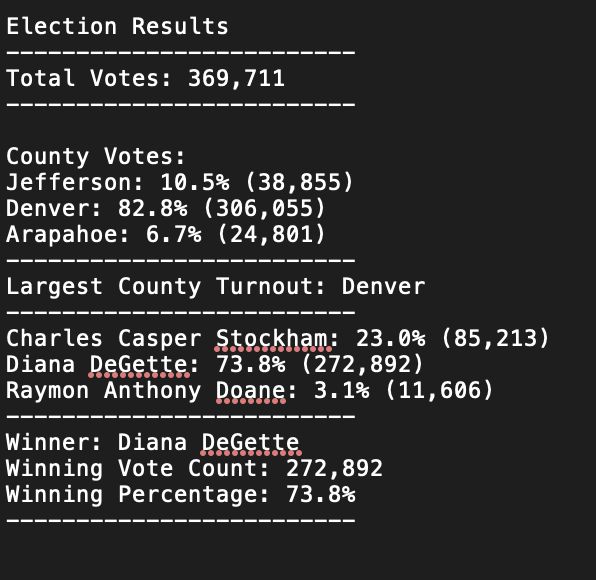

# Election-Analysis
## Overview of Election Audit
I am assisting a Colorado Board of Elections employee with auditing a recent local congressional election.

The tasks given to me were as followed:
1) Calculate total number of votes casted 
2) Create a complete list of all candidates and counties of received votes.
3) Calculate total number of votes for each candidate and county separately.
4) Calculate the percentage of votes each candidate and county won.
5) Determine the winner based on popular vote.
6) Determine the largest county turnout.

## Resources Used
- Data Source: election_results.csv
- Software: Python 3.7.6, Visual Studio Code 1.47.3, XCode 11.6

## Election Audit Results
### Analysis of the election candidates shows:

  #### There was a total of 369,711 Votes
  
  #### There were 3 candidates:
  
      1) Charles Casper Stockham
      2) Diana DeGette
      3) Raymon Anthony Doane
      
  #### Results were as follows:
  
      1) Charles Casper Stockham: 23.0% (85,213)
      2) Diana DeGette: 73.8% (272,892)
      3) Raymon Anthony Doane: 3.1% (11,606)
      
  #### Winner of the Election Stats:
  
      Winner: Diana DeGette
      Winning Vote Count: 272,892
      Winning Percentage: 73.8%
      
### Analysis of the election counties shows:

#### There was a total of 369,711 Votes
  
  #### There were 3 counties:
  
    1) Jefferson
    2) Denver
    3) Arapahoe
      
  #### Results were as follows:
  
    1) Jefferson: 10.5% (38,855)
    2) Denver: 82.8% (306,055)
    3) Arapahoe: 6.7% (24,801)
      
  #### Largest County Results:
  
    County: Denver 
    County Votes: 306,055
    County Percentage: 82.8%
    
## Summary of Results

 

## Election-Audit Summary

  This election audit was done using a script that was able to clearly identify each candidate and county in order to analyze the results of the election based on these two categories. The script was able to break down each category into subcategories such as particular number of candidates/counties and the individual stats for each subcategory withing the main category. The potential of this script does not stop with this analysis, it can be used in the future for different elections with simple modifications. Modifications’ such as a new dependency with similar output shown in the election_results.csv file, regardless of the candidates or counties shown, with a csv file, we are able to apply the same script and get similar but specific analysis for the election at hand. Another example of a simple modification that would allow us to use this script for any election would be initializing the county list and dictionary to specific values so that we get the output for those particular values.

